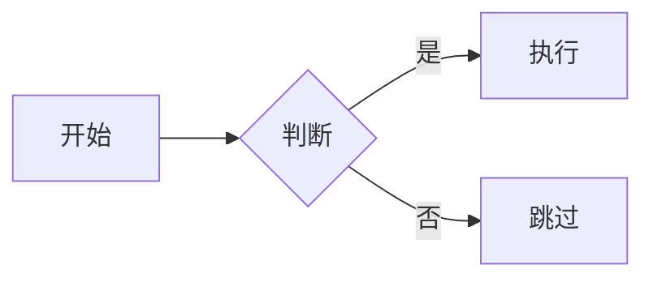

这篇文档把你在本博客写一篇新文章时会用到的**全部 Frontmatter 字段**和**正文常用 Markdown 语法**整理成可直接复制的模板。阅读后你就能完全独立地发布新文章、控制文章的分类 / 标签 / 显示 / 置顶 / 草稿 / 授权等所有元信息。

## 一、文章存放位置

所有文章都是 `.md` 或 `.mdx` 文件，放在：

```
src/content/posts/
```

文件名规范建议：`YYYY-MM-DD-slug.md`，例如 `2026-04-17-how-to-write-posts.md`。文件名会决定最终的访问 URL，请使用**小写字母 + 连字符（-）**，不要使用中文和空格。

## 二、完整的 Frontmatter 模板（可直接复制）

每篇文章最顶部 `---` 之间的这段就是 **Frontmatter（YAML 前言）**，用于声明文章的元数据：

```yaml
---
title: 文章标题
published: 2026-04-17T10:00:00+08:00
updated: 2026-04-18T12:00:00+08:00
description: 这里写一段简短摘要，会显示在列表页和搜索结果里
tags: [标签1, 标签2, 标签3]
category: 某个分类
pinned: false
draft: false
visible: true
image: ./images/cover.webp
author: ""
sourceLink: ""
licenseName: ""
licenseUrl: ""
comment: true
lang: ""
---
```

下面逐个解释每个字段。

## 三、字段详解

### 1. `title` —— 文章标题（必填）

类型：字符串。显示在浏览器标签页、文章顶部、列表页、RSS 等所有涉及标题的位置。

```yaml
title: 如何在本博客写文章
```

> 含冒号或特殊字符时请用引号包起来：`title: "3 分钟读完：Astro 是什么"`

### 2. `published` —— 发布时间（必填）

类型：日期时间（ISO 8601 格式）。用于排序、归档和显示。

```yaml
published: 2026-04-17T10:00:00+08:00
```

推荐带上 `+08:00` 时区以避免服务器时区差异。如果只写日期也可以：`published: 2026-04-17`。

### 3. `updated` —— 更新时间（可选）

类型：日期时间。当你修订一篇旧文章并希望标记"最后更新于"时填写。不填则不显示。

```yaml
updated: 2026-04-18T12:00:00+08:00
```

### 4. `description` —— 文章摘要（推荐）

类型：字符串。会出现在文章列表卡片、SEO 的 `<meta description>`、RSS 摘要中。留空时会自动截取正文开头。

```yaml
description: 手把手讲解每篇 Markdown 要写的 Frontmatter 字段。
```

### 5. `tags` —— 标签（推荐）

类型：字符串数组。一篇文章可以有多个标签，**同一个标签可跨分类使用**。

```yaml
tags: [博客, 使用指南, Markdown]
```

- 标签会出现在文章卡片、详情页顶部、标签页
- 归档页会根据标签进行二级过滤
- 建议保持 3-6 个标签，过多反而影响信息密度

### 6. `category` —— 分类（推荐）

类型：字符串。**一篇文章只能属于一个分类**。

```yaml
category: 博客指南
```

- 不填或留空时会归入"未分类"
- 分类用于粗粒度划分，标签用于细粒度描述
- 本站当前的常用分类：`博客指南` / `文章示例` / `杂谈` / `项目` 等，可以自由扩展

### 7. `pinned` —— 置顶（可选）

类型：布尔值。`true` 时文章会被置顶到主页列表最上方，并显示"置顶"徽章。

```yaml
pinned: true
```

默认 `false`。

### 8. `draft` —— 草稿（可选）

类型：布尔值。`true` 时文章**不会**出现在生产构建中（本地开发时可见），用于未完成的文稿。

```yaml
draft: true
```

默认 `false`。

### 9. `visible` —— 可见性（可选）

类型：布尔值。`false` 时文章不会出现在任何列表、分类、标签、搜索中，但仍然会被构建成可直达 URL 的页面，适合"悄悄上线但不公开入口"的场景。

```yaml
visible: false
```

默认 `true`。

> `draft` 与 `visible` 的区别：
>
> - `draft: true` = 本地看得到，线上完全不构建
> - `visible: false` = 线上有页面，但不出现在任何聚合入口

### 10. `image` —— 封面图（可选）

类型：字符串路径。支持：

- **相对路径（推荐）**：`./images/cover.webp`，与文章同目录
- **绝对路径**：`/assets/images/cover.webp`，放在 `public/assets/images/`
- **远程 URL**：`https://...`

```yaml
image: ./images/cover.webp
```

留空则列表卡片不显示封面。

### 11. `author` —— 作者（可选）

类型：字符串。当转载、引用他人作品时填写原作者。留空则使用站点默认作者。

```yaml
author: 张三
```

### 12. `sourceLink` —— 原文链接（可选）

类型：字符串 URL。转载文章时填写原文地址，会显示在文章底部"来源"处。

```yaml
sourceLink: "https://example.com/original-post"
```

### 13. `licenseName` —— 授权协议名称（可选）

类型：字符串。例如 `CC BY-NC-SA 4.0`、`MIT`、`未授权` 等。

```yaml
licenseName: "CC BY-NC-SA 4.0"
```

### 14. `licenseUrl` —— 授权协议链接（可选）

类型：字符串 URL。点击协议名称会跳转到这个链接。

```yaml
licenseUrl: "https://creativecommons.org/licenses/by-nc-sa/4.0/"
```

### 15. `comment` —— 是否允许评论（可选）

类型：布尔值。`false` 时该篇文章不显示评论区。

```yaml
comment: false
```

默认 `true`。

### 16. `lang` —— 语言（可选）

类型：字符串。覆盖文章的语言标记，比如写了一篇英文文章想让搜索引擎正确识别：

```yaml
lang: en
```

留空时使用站点默认语言（`zh_CN`）。

## 四、正文常用 Markdown 语法速查

### 标题

```markdown
# H1（文章只用一个，通常不需要写——因为 title 已经是 H1）
## H2
### H3
#### H4
```

### 段落与强调

```markdown
这是一个普通段落。

**加粗**、*斜体*、~~删除线~~、`行内代码`
```

### 列表

```markdown
- 无序项 A
- 无序项 B
  - 嵌套 B.1
  - 嵌套 B.2

1. 有序项 1
2. 有序项 2
```

### 引用

```markdown
> 这是一段引用。
> 可以换行，可以 **嵌套加粗**。
>
> > 二级引用
```

### 链接与图片

```markdown
[显示文字](https://example.com)


```

### 代码块（含语法高亮）

````markdown
```ts
const a: number = 1;
console.log(a);
```

```bash
npm run dev
```
````

### 表格

```markdown
| 列A  | 列B  | 列C  |
| :--- | :--: | ---: |
| 左   | 中   |   右 |
| aaa  | bbb  |  ccc |
```

### 分割线

```markdown
---
```

### 任务列表（GFM）

```markdown
- [x] 已完成
- [ ] 未完成
```

### 数学公式（KaTeX）

行内：`$E = mc^2$`

块级：

```markdown
$$
\int_0^1 x^2\,\mathrm{d}x = \frac{1}{3}
$$
```

### Mermaid 流程图

````markdown

````

## 五、图片怎么放最省心？

推荐"与文章同目录"：

```
src/content/posts/
├── 2026-04-17-how-to-write-posts.md
└── images/
    ├── cover.webp
    └── step1.webp
```

正文里直接用相对路径：``。Astro 会在构建期对这些图片做 **优化 / 压缩 / 响应式处理**，比放到 `public/` 更推荐。

需要跨文章共享的图片再放 `public/assets/images/` 并用绝对路径。

## 六、最小可用模板（Copy & Paste）

```yaml
---
title: 我的新文章
published: 2026-04-17T10:00:00+08:00
description: 一句话概括这篇文章讲了什么
tags: [随笔]
category: 杂谈
draft: false
visible: true
---

这里开始写正文…
```

## 七、发布流程

1. 在 `src/content/posts/` 新建一个 `YYYY-MM-DD-slug.md` 文件
2. 复制上面的**最小模板**到文件顶部并填好字段
3. 写正文
4. `npm run dev` 本地预览
5. `git add`、`git commit`、`git push` —— CI 会自动构建部署

---

读到这里你已经掌握本博客所有文章字段的含义和使用方式了，快写一篇属于你自己的文章吧 ✨
